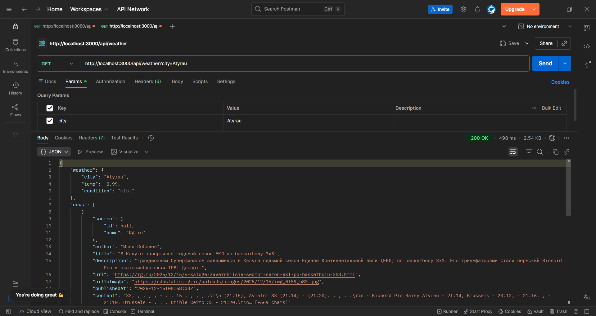
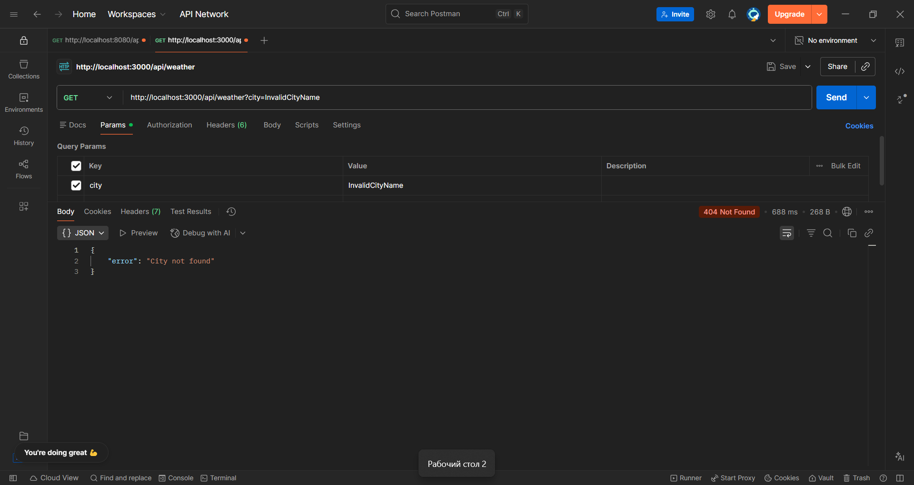
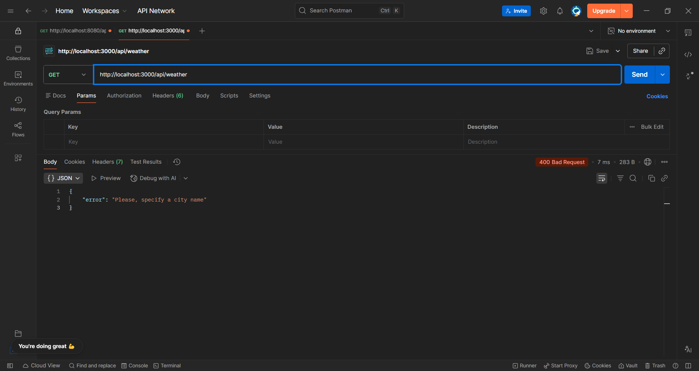

# Weather & City Info Application

## Project Description
This project is a Node.js web application developed for **Assignment 2: API**. The objective is to retrieve, process, and display data from multiple APIs using server-side logic.

The application serves as a "City Guide," allowing users to search for a city and receive:
1.  **Real-time Weather:** Detailed weather data using OpenWeatherMap.
2.  **Location Mapping:** Visual representation of the city using Leaflet (OpenStreetMap).
3.  **Local News:** Recent news articles related to the city using NewsAPI.
4.  **Attractions:** A list of popular places and sights using 2GIS API.

## Features
* **Core Requirements:**
    * Displays temperature, description, icon, coordinates, feels-like, humidity, pressure, wind speed, country code.
    * **Rain Volume:** specifically tracks rain volume for the last 3 hours.
    * **Mapping:** Interactive map pinpointing the searched location based on latitude and longitude.
* **Additional APIs (Server-Side Integration):**
    * **NewsAPI:** Fetches the top 5 latest news articles relevant to the region.
    * **2GIS API:** Searches for "sights" or "attractions" in the specific city to provide travel tips.
* **Design:**
    * Responsive user interface built with **Bootstrap 5**.
    * Server-side rendering using **EJS**.

## Tech Stack
* **Runtime:** Node.js
* **Framework:** Express.js
* **Templating:** EJS
* **HTTP Client:** Axios
* **Styling:** CSS3, Bootstrap 5
* **Mapping:** Leaflet.js (Frontend display)

## Installation and Setup

### 1. Clone the repository
Download the project files to your local machine.

### 2. Install Dependencies
Open your terminal in the project folder and run:
```bash
npm install
```

### 3. Environment Configuration
Create a `.env` file in the root directory. You must obtain API keys from the respective providers.
Add the following lines to the `.env` file:
```dotenv
PORT=3000
WEATHER_API_KEY=your_openweather_api_key
NEWS_API_KEY=your_newsapi_key
TWOGIS_API_KEY=your_2gis_api_key
```

### 4. Run the Server
```bash
node server.js
```

The application will start at: `http://localhost:3000`

## API Testing (Postman)
Per the assignment requirements, the backend logic exposes a JSON endpoint for testing purposes.

### Endpoint: Get City Info
* **URL:** `GET http://localhost:3000/api/weather`
* **Query Param:** `city` (String)

#### Test Case 1: Valid Request (200 OK)
**Request:**
`GET /api/weather?city=Atyrau`

**Response:**
```json
{
    "weather": {
        "city": "Atyrau",
        "temp": -0.99,
        "condition": "mist"
    },
    "news": [ ],
    "places": [ ]
}
```


#### Test Case 2: City Not Found (404 Not Found)
**Request:**
`GET /api/weather?city=InvalidCityName`

**Response:**
```json
{
    "error": "City not found"
}
```


#### Test Case 3: Missing Parameter (400 Bad Request)
**Request:**
`GET /api/weather`

**Response:**
```json
{
    "error": "Please, specify a city name"
}
```


## Design Decisions
1.  **Server-Side Logic:** As required, all API calls (OpenWeather, News, 2GIS) are handled inside `server.js` using `axios`. The frontend only receives the final data or rendered HTML.
2.  **Parallel Execution:** `Promise.all` is used to fetch data from all three APIs simultaneously, reducing the wait time for the user.
3.  **Error Handling:** The application gracefully handles `404` errors (city not found) by rendering a user-friendly error message on the frontend instead of crashing the server.
4.  **Security:** API keys are stored in environment variables (`.env`) and are never exposed to the client-side code.

## Project Structure
```
├── public/             # Static files (CSS, images)
├── views/              # EJS Templates
│   ├── index.ejs       # Search Page
│   └── dashboard.ejs   # Results Page
├── .env                # API Keys (Not included in repo)
├── server.js           # Main application logic
├── package.json        # Dependencies
└── README.md           # Documentation
```